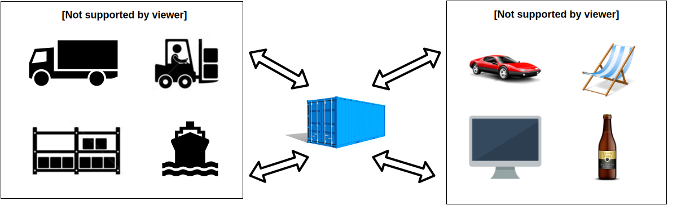

% Un introduction à Docker
% Quentin Lebourgeois
% Présentation du __DATE__

# Le constat

## Un projet classique

> - Durant votre dernier projet informatique, vous avez pu développer une application web sur votre poste de travail
> - La date de rendu approche et l'application doit être installable facilement afin d'être évaluée par l'enseignant

. . .

> Comment procédez-vous ?

## La jungle applicative

Les projets modernes s'appuient désormais sur un grand nombre d'outils divers.

Chaque brique possède ses propres spécificités de mise en place selon l'environnement et nécessite un effort d'adaptation plus ou moins important selon sa complexité.

## Illustration


## La matrice application / environnement

-------              ---         ---       ---    ---
Static Website       ?           ?         ?      ?
Database             ?           ?         ?      ?
Backend API          ?           ?         ?      ?
Frontend Website     ?           ?         ?      ?
                     Workstation QA Server Cloud  Cluster
-------              ---         ---       ---    ---

. . .

> L'effort d'adaptation doit être pensé pour chaque environnement sur lequel l'application est déployée.

# Une solution

## Le monde industriel

Avant 1960


## Introduction du conteneur

Après 1960



## Introduction de Docker

Docker est un logiciel libre qui automatise le déploiement d'applications dans des conteneurs logiciels.


> « Docker est un outil qui peut empaqueter une application et ses dépendances dans un conteneur virtuel, qui pourra être exécuté sur n'importe quel serveur Linux »

## Illustration


## Apports de Docker

Docker apporte une réponse à la problématique de la séparation entre les applicatifs et l'infrastructure.

> - Le conteneur est autosuffisant et prend en charge les contraintes de l'application
> - Les applicatifs ne sont plus dépendants de la machine physique ou virtuelle sur laquelle ils sont déployés et inversement
> - Le conteneur peut être manipulé en utilisant un jeu de commande standard applicable sur n’importe quelle plateforme

## La jungle applicative

La matrice se simplifie grandement :

-------           ---           ---        ---         ---
Static Website    Container     Container  Container   Container
Database          Container     Container  Container   Container
Backend API       Container     Container  Container   Container
Frontend Website  Container     Container  Container   Container
                  Workstation   QA Server  Cloud       Cluster
-------           ---           ---        ---         ---

## Design de Docker


## Fonctionnement interne


## Pourquoi utiliser Docker

> - Docker utilise libcontainer comme système de virtualisation, plus léger qu'une virtualisation complète du système
> - Docker repose sur des concepts et technologies connues, stables et modernes (API, Go programming, etc...)
> - Déploiement rapide et répétable à l'infini
> - S'exécute n'importe où (tant qu'on a un noyau linux &gt; 2.6)

. . .

> Passage progressif vers un modèle DevOps

## Qui utilise Docker


# Show Time!

## Premier conteneur 1/2

Commençons simplement par récupérer l'image de référence&nbsp;:

```{.bash}
$ docker pull debian:jessie
```

Lançons ensuite notre première commande :

```{.bash}
$ docker run -it debian:jessie echo "Hello World"
```

. . .

Grâce à cette commande, nous avons exécuté notre premier processus dans un conteneur.

## Premier conteneur 2/2

À l'issue de l'exécution de la commande, il est possible de consulter l'état des conteneurs sur la machine :

```{.bash}
$ docker ps -a
```

```
CONTAINER ID        IMAGE               COMMAND             CREATED              STATUS                     PORTS               NAMES
b90302cc3c47        debian:jessie       "/bin/bash"         About a minute ago   Exited (0) 4 seconds ago                       fervent_wright
```

## Manipulation directe

Il est possible aussi d'entrer dans le conteneur afin d'y effectuer des opérations :

```{.bash}
$ docker run -it debian:jessie
```

. . .

Par défaut, le point d'entrée dans le conteneur debian est `/bin/bash`

On se retrouve donc ensuite avec un prompt bien connu :

```{.bash}
root@b90302cc3c47:/# echo "Hello World"
```

## Garder une trace de son travail

Nous pouvons altérer le conteneur en effectuant des modifications. Il suffit ensuite de sauvegarder à la manière d'une gestion de configuration ses modifications :

```{.bash}
$ docker commit -m "Premier commit de conteneur" \
  b90302cc3c47 docker-demo/docker0
```

. . .

On peut ensuite contrôler que l'image a bien été reférencée en local :

```
REPOSITORY            TAG                 IMAGE ID            CREATED             VIRTUAL SIZE
docker-demo/docker0   latest              8bad3c5a9f22        6 seconds ago       125.1 MB
debian                jessie              6845b83c79fb        10 days ago         125.1 MB
```

## Next level 1/2

La manipulation directe des conteneurs telle que nous l'avons vu présente plusieurs inconvénients :

- Nécessite de documenter à coté les modifications effectuées sur le conteneur

- Oblige à sauvegarder des images parfois volumineuses

- N'est pas facilement transportable entre les projets

. . .

> Dès lors, il faut passer à la vitesse supérieure en décrivant ses conteneurs.

## Next level 2/2

Le **Dockerfile** répond à la problématique de description du conteneur.

Par exemple, voici un conteneur décrit à l'aide de ce fichier :

```{.bash}
FROM debian:jessie

CMD ["echo", "Hello World"]
```

. . .

Construction

```{.bash}
$ docker build -t docker-demo/hello .
```

. . .

Lancement

```{.bash}
$ docker run -it docker-demo/hello
```

# Pour aller plus loin

## Registry et hub Docker

Le registry Docker principal (hub) est comparable à Github pour les images Docker.

. . .

Des dizaines d'images préfabriquées prêtes à l'usage sont disponibles !

Exemple PHP + Apache :

```{.bash}
FROM php:5.6-apache
COPY src/ /var/www/html/
```

## Quelques ressources à consulter

Docker

- Documentation Docker : [https://docs.docker.com/](https://docs.docker.com/)
- Hub Docker : [https://hub.docker.com/](https://hub.docker.com/)
- Liste d'outils pour Docker : [http://veggiemonk.github.io/awesome-docker/](http://veggiemonk.github.io/awesome-docker/)

Cette présentation

- Slides et démos : [https://github.com/64q/docker-introduction](https://github.com/64q/docker-introduction)

## Questions

Me contacter

[quentin.lebourgeois at soprasteria.com](mailto:quentin.lebourgeois at soprasteria.com)
